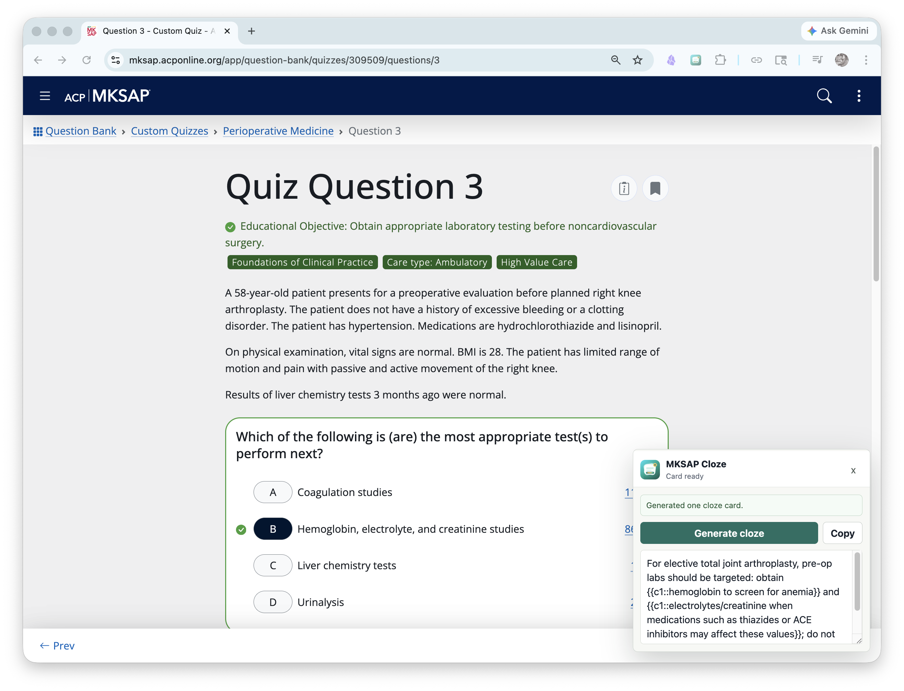

# Practice Question to Anki Cloze



A minimal Chrome extension that reads the current MKSAP answer page and asks local Codex to generate one concise Anki cloze card.
**soon:** *make extendable across all sites*

## What It Does

- Opens as a bottom-right panel on `https://mksap.acponline.org/app/`.
- Captures the page with `document.body.innerText`.
- Sends the captured text to a local bridge at `http://127.0.0.1:4555`.
- The bridge talks to the local Codex app-server.
- Automatically generates one cloze card when the panel first opens.
- Provides a one-click `Copy` button for pasting into Anki.

v1 is copy-only. It does not import directly into Anki.

## Requirements

- Chrome or another Chromium browser that supports Manifest V3 extensions.
- Codex CLI installed and authenticated.

Start the local stack before using the extension:

```sh
npm start
```

This starts both:

- the extension bridge at `http://127.0.0.1:4555`
- Codex app-server at `ws://127.0.0.1:4500`

Press `Ctrl-C` in that terminal to stop both. Browser-originated WebSocket requests include an `Origin` header and Codex app-server rejects those requests, so the bridge uses a small Node WebSocket transport that omits `Origin` when forwarding to the local app-server.

## Load the Extension

1. Open `chrome://extensions`.
2. Enable `Developer mode`.
3. Click `Load unpacked`.
4. Select this repository folder.
5. Open an MKSAP answer page at `https://mksap.acponline.org/app/`.
6. In this repo, run `npm start`.
7. Click the extension icon to show or hide the bottom-right panel.
8. The first cloze generates automatically; click `Generate cloze` again only when you want a fresh card.

## Bridge Origin Policy

The local bridge allows requests without a browser `Origin` header, such as local health checks. Browser-originated requests are limited to Chrome extension origins by default.

For stricter local use, set an exact comma-separated allowlist before starting the bridge:

```sh
ALLOWED_ORIGINS=chrome-extension://your-extension-id npm start
```

## Privacy

The extension does not store page text or generated cards. It sends the current page text only to the local bridge running on `127.0.0.1:4555`. The bridge forwards the request to Codex app-server on the same machine. Codex app-server may keep its own local thread/history logs according to your Codex configuration.

## Development

Run tests with:

```sh
npm test
```
